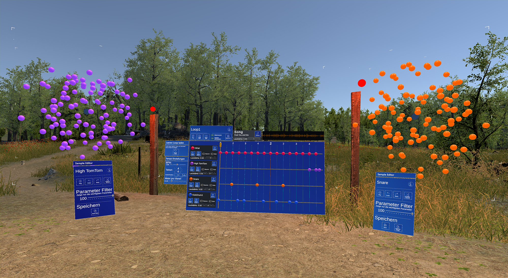
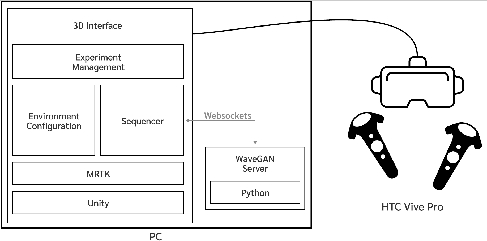
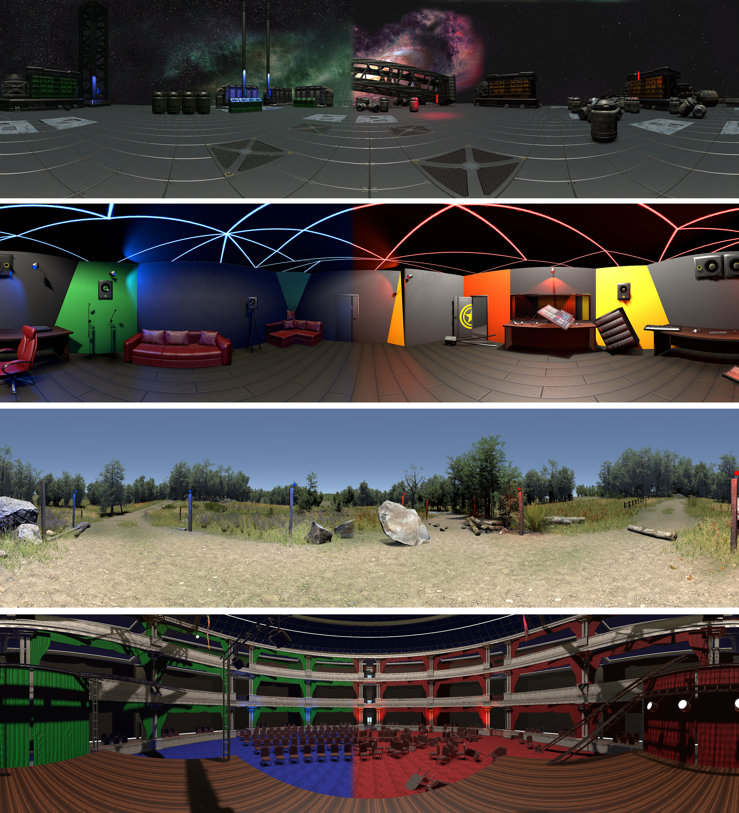

# Virtual Reality Drum Sequencer with customizable virtual environments
A VR-based drum sequencer built for creativity support through customizable environments.
Created as part of Fabian Wildgrube's Master Thesis at the University Augsburg.
> Thesis Title: __Exploring Opportunities for Musical Creativity Support in VR through Human-Computer-Interfaces and Interaction Design__

The Sequencer in Action | System Architecture
:---:|:---:
 |

## Contents
Each subdirectory contains its own README.md file for further documentation.

* `/PFS-VR_CreativityPrototype` - the Unity project of the VR sequencer
* `/WaveGAN_Server` - the server that generates drum samples using the Donahue ML models

## Running the VR prototype
1. Make sure to follow the setup instructions in the project's [README](./PFS-VR_CreativityPrototype/README.md) 
2. Start the WaveGAN_Server as described in its [README](./WaveGAN_Server/README.md)
3. Open the Unity project in `/PFS-VR_CreativityPrototype`
4. Start the Play mode in Unity

## The Environments
Four environments were designed: Meadow, Outer Space, Music Studio, Concert Hall.
Unity asset store packages were used and users are provided with customization parameters.

Screenshot of the four environments (left: all objects, completely tidy, blue and green colors, right: all objects, completely untidy, red and orange colors)

